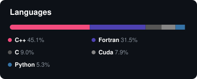

  <picture>
    
  </picture>

  
  

## About Me

I am a Ph.D. Candidate in Chemistry at the **University of Florida**, specializing in high-performance computing (HPC), molecular dynamics simulations, and AI-driven structural biology. My work bridges the gap between complex computational physics and scalable, hardware-accelerated software engineering.

---
- 🏆 **Recent Highlights:** Recipient of the <a href="https://ai.ufl.edu/teaching-with-ai/for-uf-faculty/ai-faculty-awards/biography/thenahandi-namindu-rangana-de-silva.html">2025 HiPerGator Early Career</a> & <a href="https://ai.ufl.edu/teaching-with-ai/for-uf-faculty/ai-faculty-awards/#:~:text=Perez%20Lab%20Gators%20Team">Pioneering Team Awards</a>, Global Winning team <a href="https://github.com/PDNALab">**(PDNALab)**</a>    of the BioML Challenge <a href="https://www.biomlsociety.org/challenge#:~:text=to%20the%20designs.-,%E2%80%94,and%20Furman%20Lab%20(11%25).">(Bits to Binders 2024-2025)</a>.

- 🤝 **Let's Collaborate:** Always open to projects at the intersection of AI, statistical thermodynamics, and molecular modeling.
---

## Tech Stack & Tools

  
  
  
  
  
  
  
  
  

 

<table>
  <tr>
    <td align="center" width="25%">
      <h3>Machine Learning</h3>
      

        
         
        
         
        
      

    </td>
    <td align="center" width="25%">
      <h3>Programming</h3>
      

        
         
        
         
        
      

    </td>
    <td align="center" width="25%">
      <h3>Systems & HPC</h3>
      

        
         
        
         
        
         
        
      

    </td>
    <td align="center" width="25%">
      <h3>Simulations</h3>
      

        
         
        
         
        
      

    </td>
  </tr>
</table>

---

## Selected Publications

- **De Silva, N.**, Perez, A. (2025). [Predicting rare DNA conformations via dynamical graphical models: a case study of the B→A transition.](https://doi.org/10.1093/nar/gkaf601) _Nucleic Acids Research_.
- **De Silva, N.**, Perez, A. (2025). [MDZip: Neural Compression of Molecular Dynamics Trajectories for Scalable Storage and Ensemble Reconstruction.](https://doi.org/10.1021/acs.jpcb.5c05348) _The Journal of Physical Chemistry B_.

---

## GitHub Activity

  

